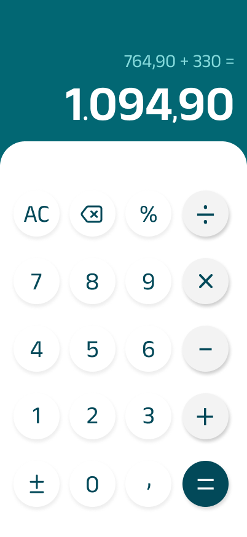

# 📱 Projeto - Calculadora em React Native

# ✅ To-do

- [x] Definir Requisitos  
- [x] Criar Protótipo  
- [x] Elaborar Documentação de Negócio  
  - [ ] Print do app rodando no celular
  - [x] Inserir documentação no `README.md`  
- [ ] Implementar Código  

---

# 📋 Requisitos

## 🎯 Requisitos Funcionais

- O aplicativo deve permitir ao usuário inserir números de **0 a 9**.
- O aplicativo deve permitir inserir números decimais utilizando **vírgula (,)**.
- O sistema deve disponibilizar as operações:
  - ➕ Soma  
  - ➖ Subtração  
  - ✖️ Multiplicação  
  - ➗ Divisão  
- O sistema deve permitir calcular **porcentagem (%)**.
- O sistema deve permitir alternar o sinal do número (**+/−**).
- O aplicativo deve calcular e exibir o resultado ao clicar no botão **igual (=)**.
- O sistema deve permitir limpar completamente a operação atual (**AC**).
- O sistema deve permitir apagar o último valor digitado (**backspace**).
- O visor deve exibir a expressão digitada e o resultado final em destaque.
- O visor deve ser atualizado a cada interação do usuário com os botões.

---

## ⚙️ Requisitos Não Funcionais

- O aplicativo deve ser desenvolvido utilizando **React Native**.
- Deve funcionar em dispositivos **Android e iOS**.
- A interface deve ser **simples, intuitiva e responsiva**, seguindo o protótipo definido.
- O tempo de resposta ao interagir com os botões deve ser **imediato**.
- Os valores exibidos devem seguir o padrão numérico brasileiro (**vírgula para decimais**).

---

# 🎨 Protótipo

## 📌 Descrição do Protótipo

O protótipo foi desenvolvido no **Figma**, utilizando um layout mobile-first, com foco em:

- Clareza visual do resultado
- Hierarquia visual bem definida
- Separação entre visor e teclado
- Destaque visual para o botão "="
- Diferenciação visual entre botões numéricos e operadores

A parte superior da tela foi projetada para exibir:
- A expressão digitada
- O resultado em destaque com fonte maior

A parte inferior foi estruturada em formato de **grid**, simulando uma calculadora real, com:
- Botões organizados em linhas
- Operadores destacados visualmente
- Botão "=" com cor diferenciada para indicar ação principal

O design prioriza contraste, legibilidade e usabilidade.

---

# 📋 Documentação de Negócio

## 📌 Visão Geral do Projeto

O projeto consiste no desenvolvimento de um aplicativo de **calculadora mobile** utilizando **React Native**, com o objetivo de oferecer ao usuário uma ferramenta prática, intuitiva e visualmente organizada para realizar cálculos matemáticos básicos no celular.

A proposta do aplicativo é reproduzir a experiência de uso de uma calculadora moderna, com interface limpa, operações essenciais e resposta rápida às interações do usuário.

---

## ❗ Problema de Negócio

No dia a dia, usuários frequentemente precisam realizar cálculos rápidos em dispositivos móveis, seja para tarefas pessoais, acadêmicas ou profissionais. Embora existam calculadoras nativas em diversos aparelhos, o desenvolvimento deste projeto busca criar uma solução própria com foco em:

- aprendizado prático de desenvolvimento mobile;
- construção de uma interface personalizada;
- aplicação de conceitos de usabilidade;
- organização de requisitos e prototipação de software.

Dessa forma, o projeto não apenas entrega uma funcionalidade útil, mas também serve como aplicação prática de conceitos de engenharia de software e desenvolvimento de interfaces.

---

## 🎯 Objetivo Geral

Desenvolver um aplicativo de calculadora em React Native que permita ao usuário realizar operações matemáticas básicas de forma rápida, simples e intuitiva.

---

## 💡 Solução Proposta

A solução proposta é um aplicativo mobile de calculadora com interface inspirada em calculadoras modernas, contendo:

- visor para exibição da expressão e do resultado;
- teclado numérico organizado em grade;
- operadores matemáticos básicos;
- funções adicionais como porcentagem, alteração de sinal, limpeza total e remoção do último caractere.

O aplicativo foi pensado para ser simples, funcional e visualmente claro, priorizando a experiência do usuário.

---

## 🖼️ Imagem do Protótipo

## 🔗 Link do Protótipo no Figma

O protótipo completo pode ser acessado diretamente pelo Figma clicando no link abaixo:

👉 **[Visualizar Protótipo no Figma](https://www.figma.com/design/UXxaO598SJbEfJDiIfIbPV/Calculadora?node-id=0-1&t=LwO62jzjHexnyU3P-1)**